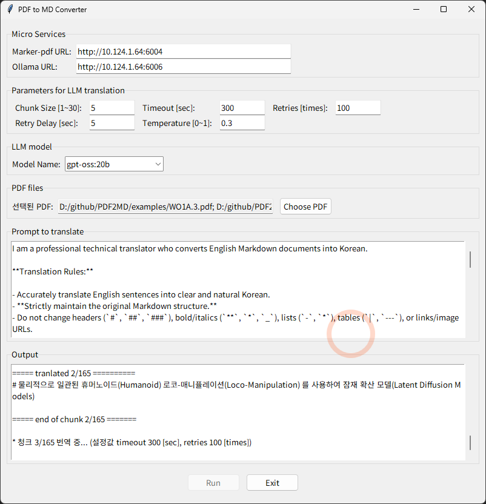

# PDF2MD

_Marker-pdf 및 Ollama를 사용하여 pdf 논문 또는 문서를 markdown으로 변환하고, 한국어 번역까지 수행하는 스크립트_



## Requirements
* CUDA 지원되는 GPU 또는 NPU (Marker-pdf에서 Pytorch를 사용함)
* Ollama에서 중소형 이상급 LLM 모델 구동 가능할 것 (10b 이하의 작은 모델의 번역 성능은 별로 좋지 않았음)


## Prerequisites

### 1. Marker-pdf API Server (pdf to markdown converter)
* https://github.com/datalab-to/marker
* 필요시 로컬에 설치해서 사용 가능
* `Marker API` 서버가 실행되고 있어야 함

### 2. Ollama (Private LLM for translation)
* https://ollama.com/
* 로컬에 설치해서 사용 가능
* 번역 성능 및 품질을 보장하려면 가능한 큰 모델을 사용하는 것을 추천
* 중소형 모델 중에서는 "gpt-oss:20b" 모델 추천
* `ollama serve`가 실행되고 있어야 함

### 3. Quarto (pdf renderer)
* https://github.com/quarto-dev/quarto-cli
* 공학용 문서 변환기
* Pandoc 및 LaTeX을 별도로 직접 설치해서 셋팅하는 것 보다 훨씬 간편하고 가벼움
* Quarto를 설치하면 그 안에 Pandoc이 내장 및 설정이 완료되어 있음
* 수학식 표현에 LaTeX 대신 Typst 사용 가능
* scoop로 설치할 경우:

```
scoop install extras/quarto
```

### 4. Fonts (for pdf rendering)
* [Noto Sans KR](https://fonts.google.com/noto/specimen/Noto+Sans+KR?selection.family=Noto+Sans+KR:wght@100..900|Noto+Serif+KR:wght@200..900)
* [Noto Serif KR](https://fonts.google.com/noto/specimen/Noto+Serif+KR?selection.family=Noto+Sans+KR:wght@100..900|Noto+Serif+KR:wght@200..900)
* [Noto Sans Mono](https://fonts.google.com/selection?selection.family=Noto+Sans+KR:wght@100..900|Noto+Serif+KR:wght@200..900&query=Noto+Sans+Mono+KR)

### 5. uv package manager for python
* https://github.com/astral-sh/uv
* scoop로 설치할 경우:

```
scoop install main/uv
```


## How to use

* MS Windows

```
PDF2MD.bat
```

* Linux

```
./pdf2md.sh
```

## Tips
* GPU Memory 48GB 시스템에서 시험하였음 (NVIDIA RTX A6000)
* Ollama Cloud에서 제공되는 120b 등의 대형 LLM 모델의 번역 성능은 상당히 훌륭함
* 그러나 Ollama Cloud는 유료 서비스이므로 제한이 있음
* 따라서 자원이 허락할 경우, 대형 모델을 추천하지만, 속도 및 자원제한을 고려할 때 워크스테이션 레벨에서는 중소형 모델을 사용할 수 밖에 없음
* `gpt-oss:20b` 모델이 빠르고 비교적 오류가 적은 편으로, 가장 훌륭한 결과를 보여줌
* 다만 간혹 번역을 포기하는 청크가 발생하거나 하는 등의 약간의 불완전함 존재
* `qwen3:30b` 모델이 번역 자체는 더 우수하게 수행해 주지만, 안정성이 좋지 않고 속도가 좀 더 느림
* 현재까지 최고로 좋은 모델은 `qwen3-vl:30b-a3b-instruct` 동급 모델들 중에서 차원이 다른 속도와 품질을 보여줌
* Chunk Size는 3~5 추천함.  10 이상일 경우에는 퍼포먼스 및 안정성이 크게 저하됨
* Temperature는 0.2~0.4 범위로 제한할 것을 권장


## 개발목적

### 대량의 정리된 논문 데이타 확보
* pdf 논문 문서들은 LLM RAG용으로 부적합
* 따라서 구조화된 Markdown으로 변환 필요
* 가능하면 한국어 번역까지 일괄 자동 처리 필요

### 유료 번역 서비스 한계
* 유료로 사용하더라도 토큰 리밋에 봉착하여 무제한적으로 사용하기 곤란
* 번역 작업은 간헐적, 비주기적으로 발생하므로 유료 구독시 비용 낭비 발생

### 기존 무료 오픈소스 한계
* pdf 논문 번역을 가장 잘 하는 기존 오픈소스 소프트웨어는 [PDFMathTranslate](https://github.com/Byaidu/PDFMathTranslate)
* 나머지는 실무적으로 사용하기 곤란한 수준의 퀄리티를 보여줌
* PDFMathTranslate 역시 충분히 만족할만한 퀄리티를 보여주지는 못함
* 또한 Markdown 파일을 얻을 수 없다는 한계

### 기존 무료 오픈소스 소프트웨어들의 장점 병합
* Markdown 생성에 Marker-pdf 활용
* 번역 작업에 Ollama 활용
* pdf 랜더링에 Quarto 활용


## 기대효과

* 대량의 논문을 Markdown으로 변환하여 체계적 활용 가능
* 대량의 논문을 한국어 번역하여 용이한 활용 가능
* 현존 오픈소스 번역기 [LibreTranslate](https://ko.libretranslate.com) 보다 확연하게 우수함
* 유료 번역 서비스들 (DeepL, MS/Google/Amazon Translators...) 보다 비용 효율적이고 보안성 유리

